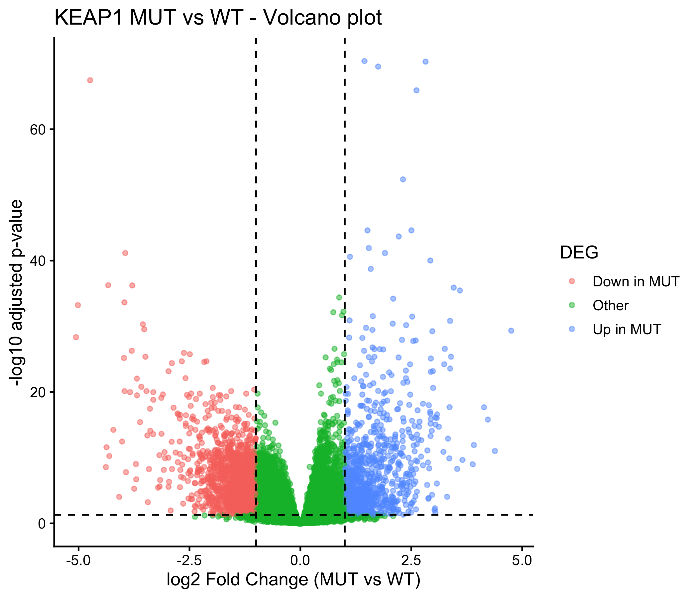
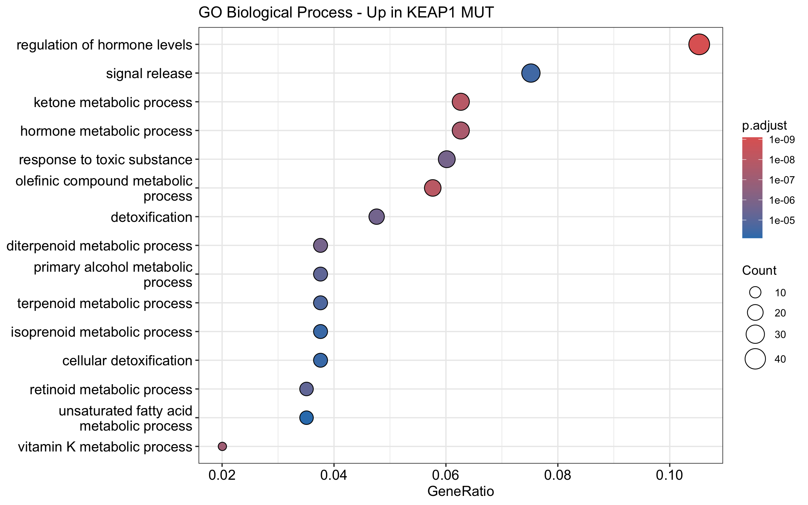
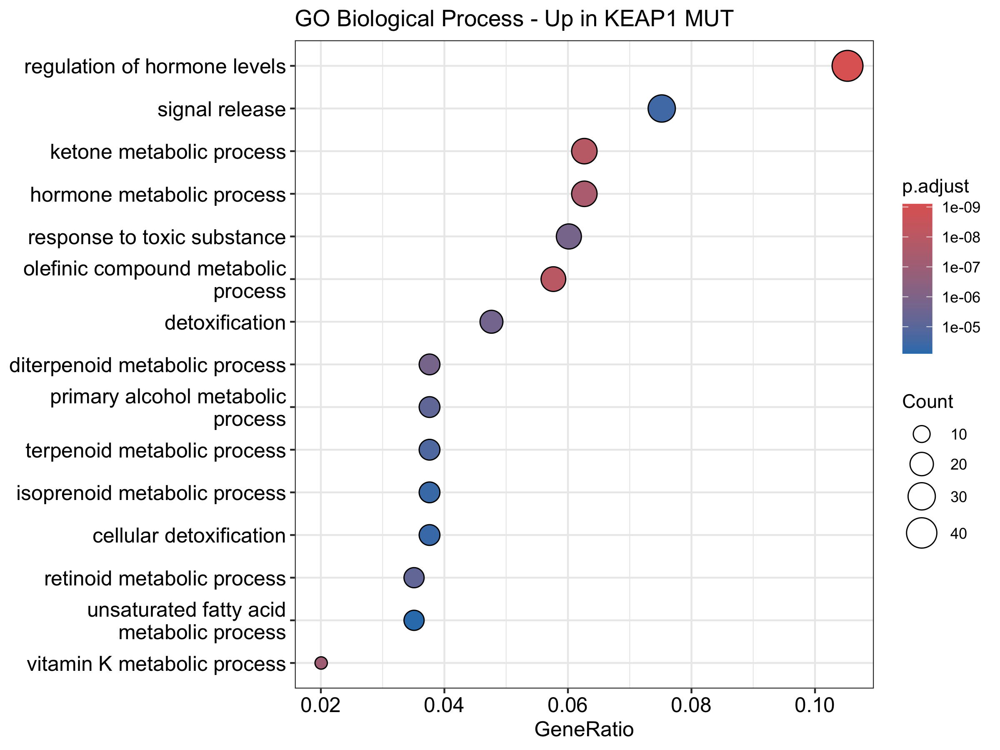
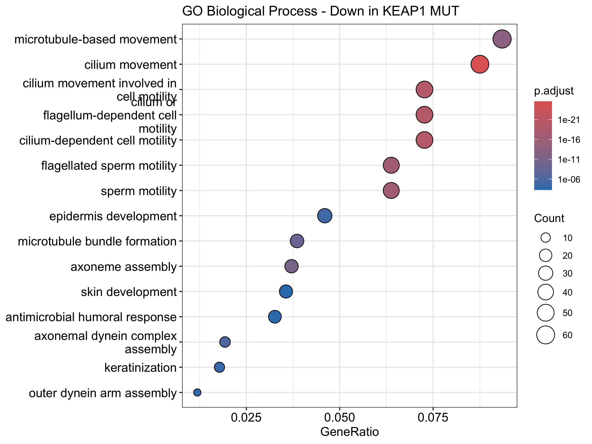
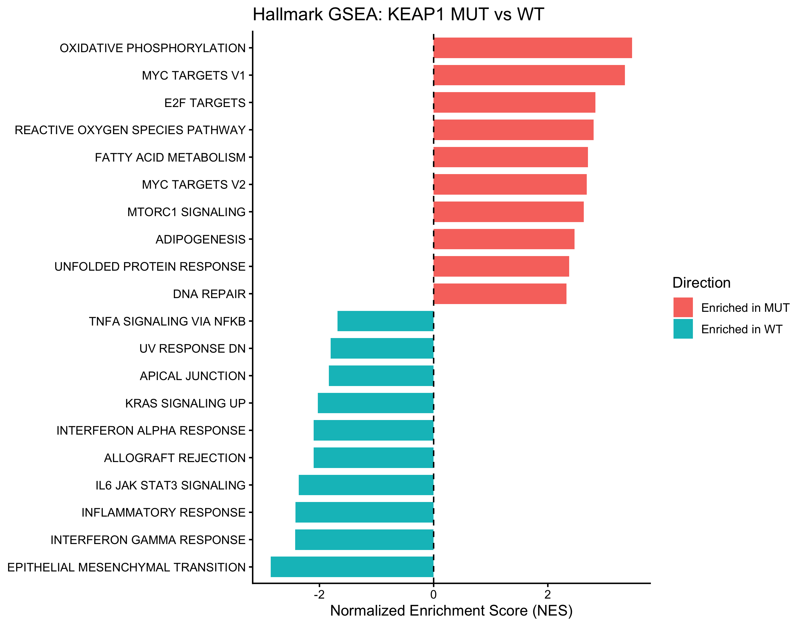
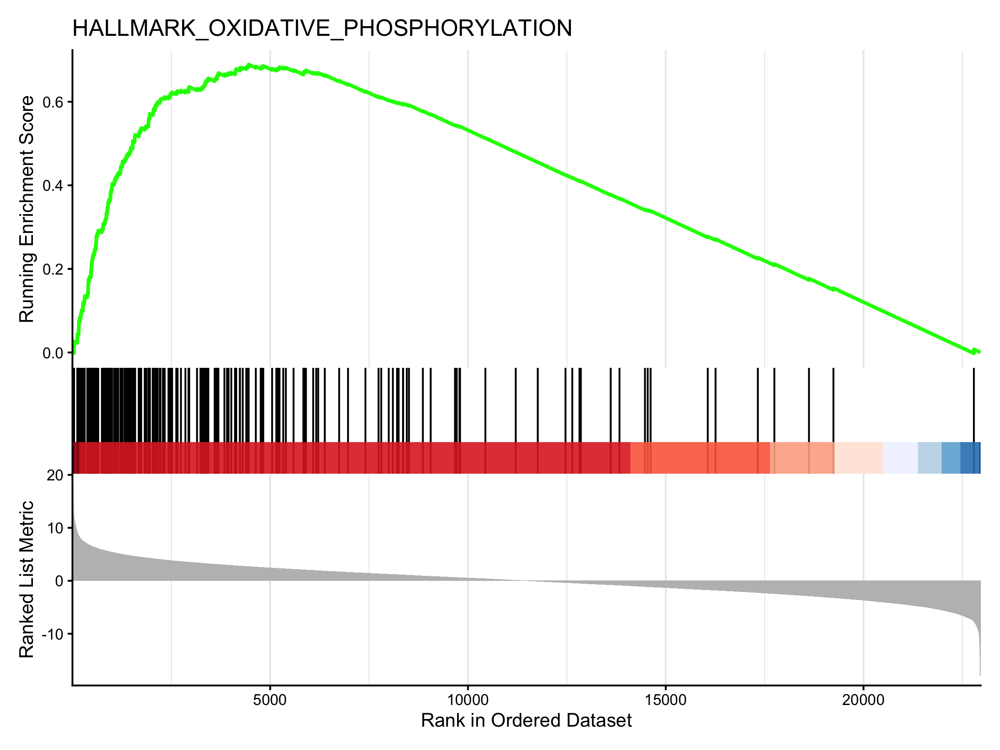

---

# Genome-wide Transcriptomic Analysis

## 분석 목적

기존의 PIK3CB, PI3K 등 특정 유전자나 pathway를 미리 지정하지 않고,  
**KEAP1 mutation status에 따라 TCGA-LUAD 전체 transcriptome에서 어떤 유전자와 biological pathway가 달라지는지 탐색**했습니다.

### 분석 코호트

| 항목 | 수 |
|---|---:|
| 전체 환자 | **507** |
| KEAP1 WT | **416** |
| KEAP1 MUT | **91** |
| 분석 유전자 | **31,871** |

RNA-seq raw count를 사용하여 DESeq2 분석을 수행했으며,  
low-count gene은 `count ≥ 10`인 sample이 10개 이상인 경우만 유지했습니다.

주요 DEG 기준은 다음과 같이 설정했습니다.

- FDR (`padj`) < 0.05
- `|log2FoldChange| ≥ 1`

---

## 1. KEAP1 MUT vs WT Genome-wide DEG

KEAP1 MUT와 WT를 비교한 결과,

**2,468개의 유전자**가 FDR < 0.05 및 |log2FC| ≥ 1 기준을 만족했습니다.

| 방향 | DEG 수 |
|---|---:|
| KEAP1 MUT에서 증가 | **976** |
| KEAP1 MUT에서 감소 | **1,492** |
| 전체 | **2,468** |

<p align="center">
  
</p>

Volcano plot에서 KEAP1 MUT와 WT 사이에 다수의 발현 차이가 확인되었으며,  
MUT에서 감소한 유전자가 증가한 유전자보다 다소 많았습니다.

### 대표적인 protein-coding DEG

매우 낮은 발현량에서 큰 fold change가 나타나는 유전자의 과도한 해석을 줄이기 위해  
`protein-coding`이면서 `baseMean ≥ 50`인 유전자도 별도로 확인했습니다.

| MUT에서 증가 | log2FC | MUT에서 감소 | log2FC |
|---|---:|---|---:|
| PCSK2 | +4.75 | CA10 | -5.02 |
| CPLX2 | +4.14 | SLC1A7 | -4.74 |
| AKR1C1 | +3.60 | IL37 | -4.33 |
| AKR1C2 | +3.38 | HHLA2 | -3.97 |
| AKR1B10 | +3.12 | SHISA3 | -3.95 |
| ALDH3A1 | +2.99 | VSIG1 | -3.79 |

대표적인 Up/Down DEG 40개의 발현 패턴을 heatmap으로 시각화했습니다.

<p align="center">
  
</p>

> 이 heatmap은 DEG 분석에서 선별된 유전자를 시각화한 것으로, 독립적인 검증 결과로 해석하지 않았습니다.

---

## 2. GO Biological Process 분석

KEAP1 MUT에서 증가한 DEG와 감소한 DEG를 분리하여  
GO Biological Process enrichment analysis를 수행했습니다.

### KEAP1 MUT에서 증가한 유전자

주요 enrichment는 다음 biological theme에서 관찰되었습니다.

- Detoxification
- Response to toxic substance
- Hormone / lipid metabolism
- Retinoid / terpenoid metabolism
- Ketone 및 fatty-acid 관련 대사

### KEAP1 MUT에서 감소한 유전자

반대로 다음과 같은 cilia / cytoskeleton 관련 biological process가 강하게 나타났습니다.

- Cilium movement
- Axoneme assembly
- Microtubule-based movement
- Axonemal dynein complex assembly
- Epithelial / keratinization-related process

<p align="center">
  
  
</p>

특히 KEAP1 MUT에서 감소한 유전자에서는  
**cilium / axoneme 관련 biological process가 매우 강하게 enrichment**되었습니다.

GO 결과에서 나타난 `sperm motility` 등의 term은 폐암에서 생식 기능의 변화를 의미하는 것이 아니라,  
정자 꼬리와 섬모가 공유하는 **axoneme, dynein, microtubule 관련 유전자**가 포함되어 있기 때문으로 해석했습니다.

---

## 3. KEGG Pathway Enrichment

KEGG 분석에서도 GO에서 관찰된 metabolic / detoxification pattern이 반복되었습니다.

KEAP1 MUT에서 증가한 DEG의 주요 pathway는 다음과 같습니다.

| KEGG pathway | FDR |
|---|---:|
| Metabolism of xenobiotics by cytochrome P450 | 7.64 × 10⁻⁷ |
| Steroid hormone biosynthesis | 1.96 × 10⁻⁵ |
| Drug metabolism - cytochrome P450 | 4.98 × 10⁻⁵ |
| Tyrosine metabolism | 9.52 × 10⁻⁵ |
| Glutathione metabolism | 5.15 × 10⁻⁴ |
| Retinol metabolism | 4.42 × 10⁻³ |

특히 **xenobiotic metabolism, cytochrome P450, glutathione metabolism**이 유의하게 나타나  
GO에서 확인된 detoxification-related pattern과 일관된 결과를 보였습니다.

KEAP1 MUT에서 감소한 DEG에서는 다음 pathway가 유의했습니다.

- Cornified envelope formation
- cAMP signaling
- Cadherin signaling
- Cytoskeleton-related pathways

GO와 KEGG를 종합하면, KEAP1 mutation status에 따라  
**대사·해독 관련 유전자 프로그램과 ciliary / epithelial-related program의 차이**가 나타났습니다.

---

## 4. Hallmark GSEA

DEG cutoff에 의존하지 않고 전체 transcriptome의 변화 방향을 확인하기 위해  
DESeq2 statistic으로 **22,961개 유전자를 ranking하여 Hallmark GSEA**를 수행했습니다.

50개의 Hallmark gene set 중 **40개가 FDR < 0.05**를 보였습니다.

### KEAP1 MUT 쪽으로 enrichment된 pathway

| Hallmark pathway | NES |
|---|---:|
| Oxidative phosphorylation | **+3.48** |
| MYC targets V1 | **+3.35** |
| E2F targets | **+2.84** |
| Reactive oxygen species pathway | **+2.80** |
| Fatty acid metabolism | **+2.70** |
| MYC targets V2 | **+2.68** |
| mTORC1 signaling | **+2.63** |

### KEAP1 WT 쪽으로 enrichment된 pathway

| Hallmark pathway | NES |
|---|---:|
| Epithelial–mesenchymal transition | **-2.85** |
| Interferon-γ response | **-2.42** |
| Inflammatory response | **-2.42** |
| IL6–JAK–STAT3 signaling | **-2.36** |
| Interferon-α response | **-2.10** |
| KRAS signaling up | **-2.03** |

`NES > 0`은 KEAP1 MUT 쪽으로 enrichment된 gene program을,  
`NES < 0`은 KEAP1 WT 쪽으로 enrichment된 gene program을 의미합니다.

<p align="center">
  
</p>

Hallmark GSEA에서는 KEAP1 MUT에서

**oxidative metabolism / ROS / fatty-acid metabolism / MYC / E2F / mTORC1**

관련 gene program이 상대적으로 강하게 나타났습니다.

반대로 WT에서는

**interferon / inflammatory / IL6-JAK-STAT3**

관련 gene program이 상대적으로 강하게 나타났습니다.

---

## 5. Oxidative Phosphorylation

Hallmark GSEA에서 가장 높은 positive NES를 보인 pathway는  
**Oxidative Phosphorylation**이었습니다.

- NES = **+3.48**
- KEAP1 MUT 쪽으로 강한 enrichment

<p align="center">
  
</p>

Oxidative phosphorylation 관련 유전자들이 ranked gene list의 KEAP1 MUT 방향에 집중되어 있었으며,  
ROS pathway 역시 **NES = +2.80**으로 같은 방향의 enrichment를 보였습니다.

이는 GO/KEGG에서 관찰된 detoxification 및 metabolic process와 함께  
KEAP1 MUT에서 **oxidative / metabolic transcriptional program이 상대적으로 강하게 나타나는 패턴**을 보여줍니다.

---

## 6. 임상변수에 대한 Sensitivity Analysis

KEAP1 WT와 MUT 사이의 임상적 차이가 transcriptomic 결과에 영향을 줄 가능성을 확인했습니다.

| 변수 | P-value |
|---|---:|
| Age | 0.537 |
| Sex | 0.0396 |
| Pathologic stage | 0.0304 |
| Smoking status | 0.00554 |

Age는 유의한 차이가 없었으나,  
**sex, pathologic stage, smoking status는 WT/MUT 간 차이**가 확인되었습니다.

따라서 complete-case 환자를 대상으로 다음 모델을 이용한 추가 DESeq2 분석을 수행했습니다.

```text
~ sex + pathologic stage + smoking status + KEAP1 status
```

보정 분석에는 총 **379명**이 포함되었습니다.

| 그룹 | 환자 수 |
|---|---:|
| KEAP1 WT | **314** |
| KEAP1 MUT | **65** |

### DEG robustness

임상변수를 보정한 이후에도 주요 DEG pattern은 안정적으로 유지되었습니다.

| 평가 지표 | 결과 |
|---|---:|
| 보정 전 stringent DEG | **2,468** |
| 보정 후 stringent DEG | **2,236** |
| 보정 전·후 공통 stringent DEG | **1,664** |
| 공통 DEG의 방향 일치율 | **99.64%** |
| log2FC Spearman correlation | **0.893** |
| log2FC Pearson correlation | **0.874** |

즉 sex, pathologic stage, smoking status를 보정한 이후에도  
주요 유전자 발현 변화의 방향이 대부분 유지되었습니다.

### GSEA robustness

Hallmark GSEA 역시 보정 전후 매우 높은 일관성을 보였습니다.

| 평가 지표 | 결과 |
|---|---:|
| 비교한 Hallmark pathway | **50** |
| NES Spearman correlation | **0.991** |
| NES Pearson correlation | **0.993** |
| NES 방향 일치 | **49 / 50 (98%)** |

방향이 달라진 유일한 pathway는 `HALLMARK_MITOTIC_SPINDLE`이었으며,

- 보정 전 FDR = 0.990
- 보정 후 FDR = 0.946

으로 두 분석 모두 유의하지 않았습니다.

보정 후에도 주요 positive pathway인

**Oxidative phosphorylation, ROS, fatty-acid metabolism, MYC, E2F, mTORC1**

과 주요 negative pathway인

**interferon response, inflammatory response, IL6-JAK-STAT3**

의 방향이 유지되었습니다.

---

# 종합 해석

이번 genome-wide 분석에서는 특정 유전자나 pathway를 사전에 선택하지 않고  
KEAP1 MUT와 WT 사이의 전체 transcriptomic 차이를 탐색했습니다.

KEAP1 MUT 종양에서는 상대적으로 다음과 같은 gene program이 강하게 나타났습니다.

### KEAP1 MUT에서 상대적으로 증가

- Oxidative phosphorylation
- Reactive oxygen species-related program
- Xenobiotic / drug metabolism
- Glutathione-related metabolism
- Fatty-acid metabolism
- MYC / E2F-related program
- mTORC1 signaling

### KEAP1 MUT에서 상대적으로 감소

- Ciliary / axonemal gene program
- Interferon response
- Inflammatory signaling
- IL6–JAK–STAT3 signaling
- 일부 epithelial-related program

특히 **GO → KEGG → GSEA**에서 oxidative / metabolic-related transcriptional pattern이 반복적으로 관찰되었습니다.

또한 sex, pathologic stage, smoking status를 보정한 sensitivity analysis에서도  
주요 DEG와 Hallmark pathway의 방향이 대부분 유지되었습니다.

따라서 TCGA-LUAD에서 KEAP1 mutation status는  
**oxidative/metabolic, proliferative, immune/inflammatory 및 ciliary-related transcriptional program의 차이와 연관된 transcriptomic profile**을 보였습니다.

본 분석은 TCGA 공개 데이터를 이용한 **retrospective observational analysis**이므로,  
KEAP1 mutation이 이러한 transcriptomic 변화를 직접적으로 유발한다는 **인과관계(causality)를 의미하지 않습니다.**

---

## 분석 결과 파일

전체 분석 결과는 `results/` 폴더에 저장했습니다.

- `DEG_all_KEAP1_MUT_vs_WT.csv`
- `DEG_significant_KEAP1_MUT_vs_WT.csv`
- `DEG_robust_protein_coding_KEAP1_MUT_vs_WT.csv`
- `GO_BP_Up_KEAP1_MUT.csv`
- `GO_BP_Down_KEAP1_MUT.csv`
- `KEGG_Up_KEAP1_MUT.csv`
- `KEGG_Down_KEAP1_MUT.csv`
- `GSEA_Hallmark_KEAP1_MUT_vs_WT.csv`
- `DEG_adjusted_KEAP1_MUT_vs_WT.csv`
- `DEG_unadjusted_vs_adjusted_comparison.csv`
- `GSEA_Hallmark_adjusted_KEAP1_MUT_vs_WT.csv`
- `GSEA_Hallmark_unadjusted_vs_adjusted.csv`