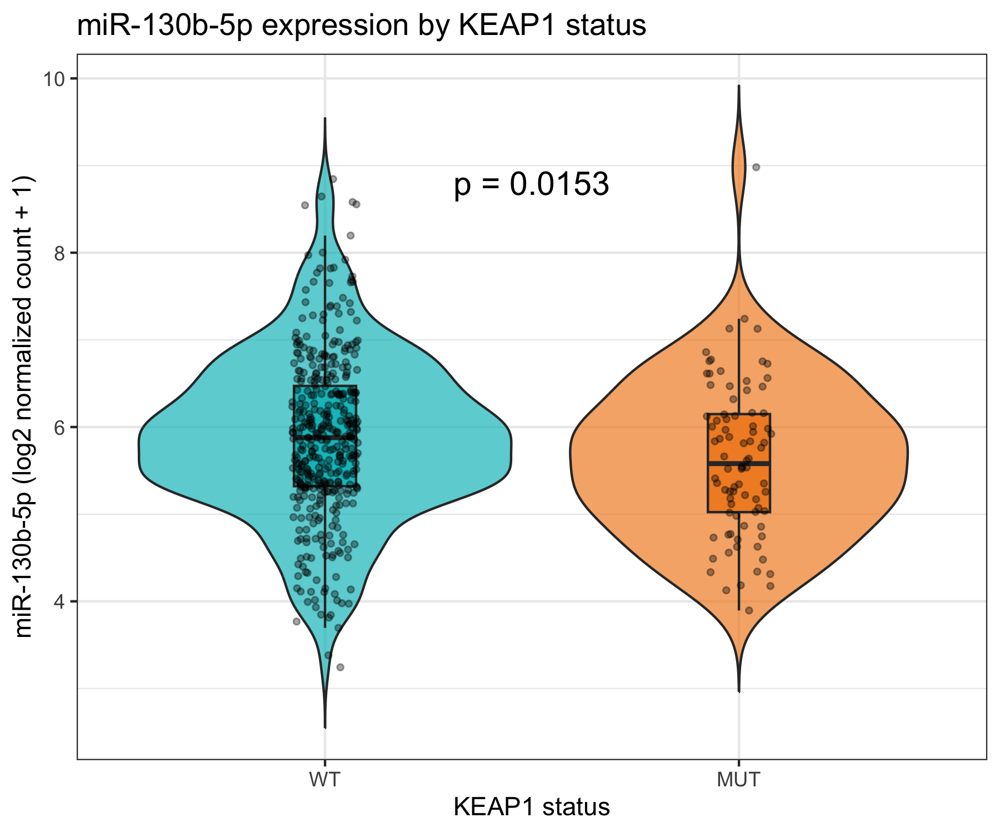
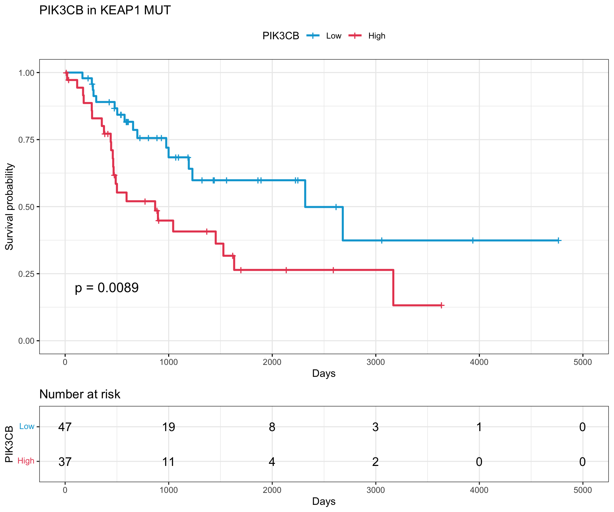
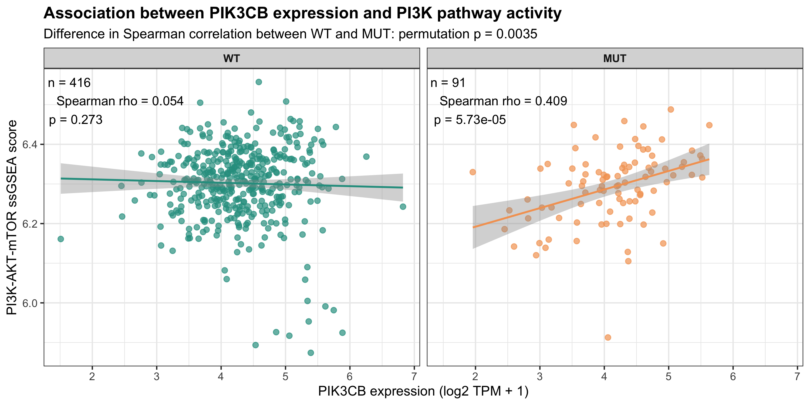
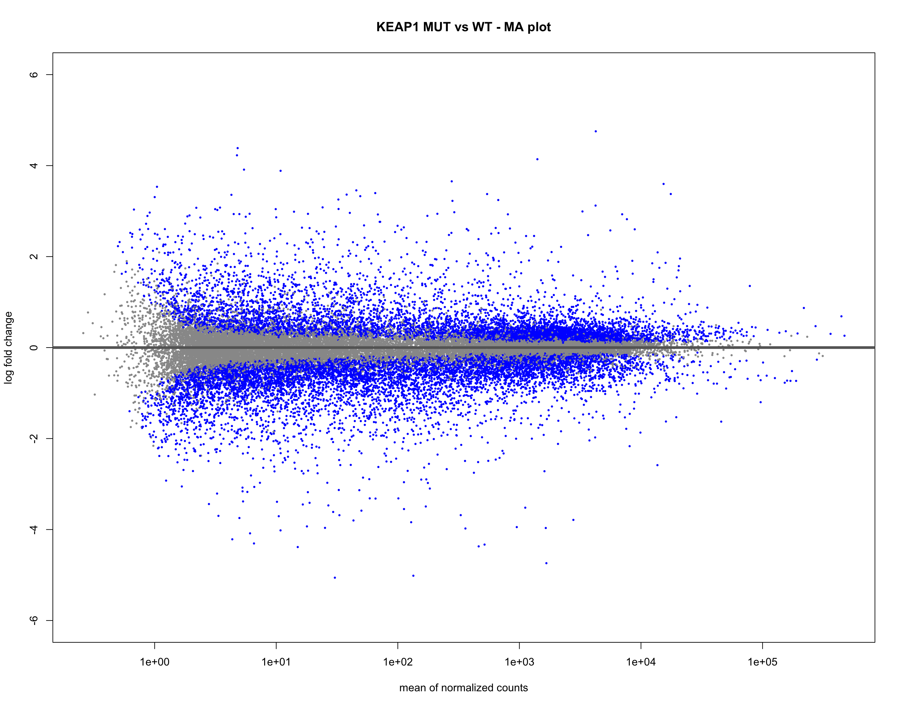

# TCGA-LUAD에서 KEAP1 / miR-130b-5p / PIK3CB 관계 분석

## 프로젝트 개요

이 프로젝트는 **TCGA-LUAD (The Cancer Genome Atlas Lung Adenocarcinoma)** 공개 데이터를 이용하여  
**KEAP1 변이 상태, miR-130b-5p 발현, PIK3CB 발현, 환자 생존, 그리고 PI3K-AKT-mTOR pathway activity의 관계**를 분석한 프로젝트입니다.

RNA-seq, miRNA-seq, somatic mutation, clinical/survival 데이터를 **TCGA barcode 기준으로 통합**하여 분석했습니다.

이 분석의 핵심 질문은 다음과 같습니다.

- **KEAP1 mutation이 miR-130b-5p 발현과 관련이 있는가?**
- **PIK3CB는 KEAP1 WT와 MUT에서 같은 의미를 가지는가?**
- **PIK3CB expression과 PI3K pathway activity의 연결이 KEAP1 상태에 따라 달라지는가?**
- **PI3K pathway 내부 유전자 패턴은 KEAP1 WT와 MUT에서 어떻게 다른가?**

---

## 사용 데이터

### TCGA-LUAD
- **RNA-seq**: STAR - Counts
- **miRNA-seq**: BCGSC miRNA Profiling
- **Somatic mutation**: Masked Somatic Mutation
- **Clinical / survival**: TCGA clinical data

### KEAP1 상태 정의
Somatic mutation profiling이 된 환자 중 **KEAP1 non-silent mutation**이 있는 경우를 **KEAP1 MUT**,  
그 외를 **KEAP1 WT**로 정의했습니다.

---

## 분석 개요

### 1. miR-130b-5p
miRNA isoform 데이터에서 mature miR-130b-5p에 해당하는  
**MIMAT0004680**을 사용했습니다.

동일 mature miRNA에 속한 isomiR count를 합산한 뒤,  
DESeq2 기반 정규화를 적용하고 다음 값을 사용했습니다.

- `log2(normalized count + 1)`

### 2. PIK3CB
RNA-seq primary tumor 데이터를 사용했고,  
생존분석에서는 다음 값을 사용했습니다.

- `log2(normalized count + 1)`

### 3. PI3K pathway activity
MSigDB Hallmark gene set인

- `HALLMARK_PI3K_AKT_MTOR_SIGNALING`

을 사용했고, GSVA의 **ssGSEA**로 pathway activity score를 계산했습니다.

### 4. Survival analysis
Overall survival(OS)을 이용하여 Kaplan-Meier 분석을 수행했습니다.  
High / Low cutoff는 **maximally selected rank statistics**로 정했습니다.

---

# 핵심 결과

## 1. KEAP1 MUT에서 miR-130b-5p 발현이 낮다

KEAP1 WT와 MUT를 비교했을 때,  
**miR-130b-5p expression은 KEAP1 MUT에서 유의하게 낮았습니다.**

- WT: n = 407
- MUT: n = 84
- WT median = 5.878
- MUT median = 5.580
- Wilcoxon rank-sum test: **p = 0.0153**



### 해석
이 결과는 **KEAP1 mutation과 낮은 miR-130b-5p expression 사이의 연관성**을 보여줍니다.

즉, KEAP1-mutant LUAD에서는 miR-130b-5p가 상대적으로 낮은 방향을 보였습니다.

---

## 2. KEAP1 MUT에서 높은 PIK3CB는 더 나쁜 생존과 연관된다

KEAP1 MUT subgroup에서 PIK3CB expression을 high / low로 나누어 overall survival을 비교했습니다.

- Low: n = 47
- High: n = 37
- Median OS
  - Low = 2318 days
  - High = 869 days
- Log-rank test: **p = 0.0089**



### 해석
**KEAP1 MUT에서는 PIK3CB high group이 유의하게 더 짧은 overall survival**을 보였습니다.

즉, PIK3CB는 전체 LUAD에서 일반적인 marker라기보다,  
**KEAP1-mutant context에서 더 중요한 예후 관련 분자**일 가능성을 시사합니다.

---

## 3. PIK3CB와 PI3K pathway activity의 연결은 KEAP1 MUT에서 더 강하다

각 환자에서 PIK3CB expression과 PI3K-AKT-mTOR ssGSEA score의 상관관계를 분석했습니다.

### KEAP1 WT
- n = 416
- Spearman rho = **0.054**
- p = **0.273**

### KEAP1 MUT
- n = 91
- Spearman rho = **0.409**
- p = **5.73e-05**

또한 WT와 MUT의 상관계수 차이를 permutation test로 비교한 결과,

- **Permutation p = 0.0035**

였습니다.



### 해석
KEAP1 WT에서는 PIK3CB expression이 pathway activity와 거의 연결되지 않았지만,  
**KEAP1 MUT에서는 PIK3CB expression이 높을수록 PI3K pathway activity도 높아지는 유의한 양의 상관관계**가 관찰되었습니다.

그리고 이 상관관계의 강도 자체도 WT보다 MUT에서 유의하게 더 컸습니다.

즉,  
**PIK3CB와 PI3K pathway의 기능적 연결이 KEAP1-mutant 배경에서 더 강화되어 있을 가능성**을 보여줍니다.

---

## 4. PI3K pathway 내부 유전자 패턴도 KEAP1 WT와 MUT에서 다르다

Hallmark PI3K-AKT-mTOR pathway gene 105개를 대상으로  
KEAP1 WT와 MUT 사이의 gene-level expression 차이를 비교했습니다.

- 분석 방법:
  - `log2(TPM + 1)`
  - Wilcoxon rank-sum test
  - Benjamini-Hochberg FDR correction

### 결과 요약
- 전체 pathway genes: 105
- FDR < 0.05: **54 genes**
- Higher in MUT: **18 genes**
- Lower in MUT: **36 genes**

대표 예시는 다음과 같습니다.

- **Lower in MUT**: EGFR, TIAM1, DAPP1, CXCR4
- **Higher in MUT**: RIT1, SQSTM1, ARF1



### 해석
전체 pathway activity score 자체는 WT와 MUT에서 크게 다르지 않았지만,  
**pathway를 구성하는 개별 유전자들의 패턴은 분명히 달랐습니다.**

즉, KEAP1 mutation은 PI3K pathway를 단순히 “전체적으로 올리거나 내리는” 것이 아니라,  
**pathway 내부 gene-expression organization을 재구성하는 방향**으로 작용할 가능성이 있습니다.

---

# 전체 결론

이 프로젝트에서 확인한 핵심 결과는 다음과 같습니다.

1. **miR-130b-5p는 KEAP1 MUT에서 WT보다 낮다.**
2. **PIK3CB high expression은 KEAP1 MUT에서 더 나쁜 생존과 유의하게 연관된다.**
3. **PIK3CB expression과 PI3K pathway activity의 연결은 KEAP1 WT보다 MUT에서 훨씬 강하다.**
4. **PI3K pathway 내부 유전자 패턴 역시 KEAP1 WT와 MUT에서 다르게 재구성되어 있다.**

## 한 줄 결론
**TCGA-LUAD에서 KEAP1-mutant tumors는 낮은 miR-130b-5p, 불량한 PIK3CB-related prognosis, 그리고 더 강한 PIK3CB–PI3K pathway coupling을 보였다.**

---

## 프로젝트 구조

```text
tcga-luad-keap1/
│
├── 01_download_tcga.R
├── 02_tcga_reproduction.R
├── README.md
├── MANIFEST.txt
│
├── figures/
│   ├── 01_miR130b_KEAP1_expression.png
│   ├── 04_PIK3CB_survival_KEAP1_MUT.png
│   ├── 06_PIK3CB_PI3K_ssGSEA_WT_MUT.png
│   └── 09_PI3K_heatmap_54_significant_genes.png
│
├── results/
└── data/
```

---

## 사용 패키지

- TCGAbiolinks
- DESeq2
- edgeR
- survival
- survminer
- ggplot2
- GSVA
- msigdbr
- pheatmap

---

## 해석 시 주의점

- 본 분석은 **TCGA 공개 데이터 기반의 retrospective observational analysis**입니다.
- 따라서 **인과관계(causality)** 를 직접 증명하는 것은 아닙니다.
- Survival cutoff는 동일 cohort에서 최적화되었기 때문에, 독립 cohort validation이 필요합니다.
- PI3K pathway gene-level comparison은 **exploratory analysis**로 해석해야 합니다.

---

## 추가 분석: Genome-wide Transcriptomic Analysis

특정 유전자나 pathway를 사전에 선택하지 않고  
**KEAP1 MUT vs WT의 genome-wide transcriptomic difference**를 추가로 분석했습니다.

주요 분석:

- DESeq2 genome-wide DEG
- GO Biological Process
- KEGG pathway enrichment
- Hallmark GSEA
- Sex / pathologic stage / smoking-adjusted sensitivity analysis

➡️ **[Genome-wide 분석 상세 결과 보기](GENOME_WIDE_ANALYSIS.md)**